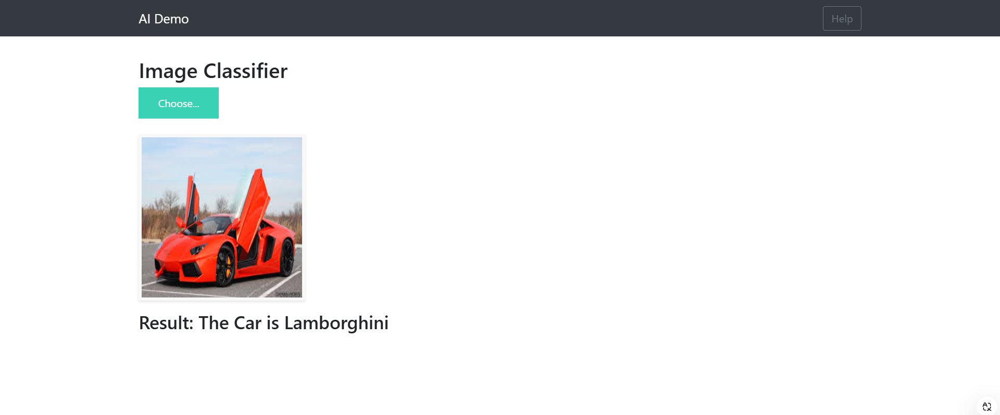

# Car-Brand-Classification-System

This project is a deep learning-based application that classifies car images into one of three brands: Audi, Lamborghini, or Mercedes. The system leverages a pre-trained ResNet-50 model for image recognition and provides a user-friendly interface via a Flask web application.

## Features
Deep Learning Model: Utilizes a ResNet-50 model trained to classify car images.
Web Interface: Flask-based frontend for easy image upload and classification.
Scalable and Efficient: Processes images quickly with real-time predictions.

**Setup**

Clone the repository:
git clone https://github.com/nakkkul/Car-Brand-Classification-System.git
cd Car-Brand-Classification-System

Install dependencies:
pip install -r requirements.txt
Run the Flask application:

python app.py
Access the application at http://localhost:5000 in your browser.

**Repository Structure**

app.py: Flask application code for handling requests and running the model.
requirements.txt: List of dependencies required to run the project.
model_resnet50.h5: Pre-trained model for car brand classification.
uploads/: Directory for storing uploaded images.
templates/index.html: HTML template for the web interface.
